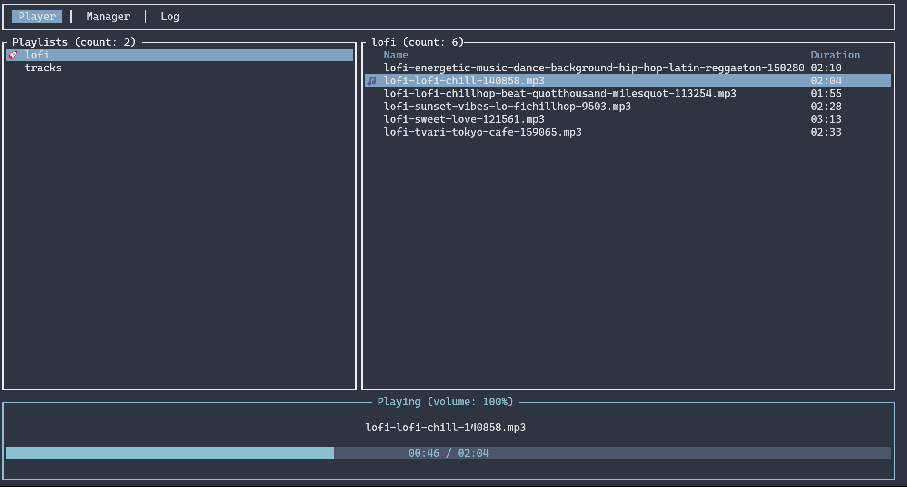

# Melody
Melody is a TUI music player. You can create playlists and play them.


## Dependencies
Linux need installed [Alsa](https://www.alsa-project.org/)
```bash
  # linux
  sudo apt install libasound2-dev
  sudo apt install pkg-config
```

## Instalation

Releases:
You can see the [releases](https://github.com/DreckSallow/melody/releases) and choose the one you want.

Git:
```bash
  git clone https://github.com/DreckSallow/melody
  cargo run
```

## Sections
- *Player Tab*: The main screen. Display the playlists/songs lists and the audio handler.
- *Manager Tab*: Create/delete playlists and select the songs for each playlist. The `Tab` key, save the playlists.
- *Log Tab*: Displat the logs of the application (Infos,Warns,Errors).

## Keybinding

#### General
- **q**: Exit.
- **Ctr + [num]**: Change the focus to correspondent section(Focus is highlighted).
- **Tab**: Change the tab (and the content).
- **Up(↑)/Down(↓)**: Change the cursor in a list.
- **Enter**: Select item.

### Playlist Manager
- **d**: Delete a playlist

#### Audio handler
- **Space**: Play/Stop the current audio.
- **m**: Toggle the audio volume (0%-100%)
- **Up(↑)/Down(↓)**: volume Up/Down

## Similar Projects
- [termusic](https://github.com/tramhao/termusic)